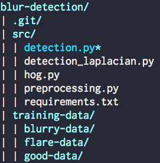

# Abyss Solutions coding challenge

Lens flare and blur detection as a classication problem

## Getting Started

These instructions will get you a copy of the project up and running on your local machine for development and testing purposes.

### Requirements
python 2.7+

### Packages

```
numpy==1.14.2
opencv-contrib-python==3.4.0.12
opencv-python==3.4.0.12
scikit-learn==0.20.0
scipy==1.1.0
sklearn==0.0
pathlib==1.0.1
```

### Getting started
1. Clone the repository
2. Download the dataset available [here][dataset]. Your directory should look like the following:



3. Create a virtual python environment with virtualenv
4. `cd src && pip install -r reqirements.txt`
5. Change the first line of detection.py from `#!/c/Python27/python` to your relative path of python 2.
6. Run with the followin options below

Detect single image and output lens flare/blurry images as 1 and good images as 0
```
python detection.py <image path> 

eg.

python detection.py ../training-data/blurry-data/20170427T163334_G0029295.jpg 

```

Detect single image output for 3 classes  (0 = good, 1 = lens flare, 2 = blurry)
```
python detection.py <image path> <optional flag1> 

eg.

python detection.py ../training-data/blurry-data/20170427T163334_G0029295.jpg --raw-prediction

```

Run cross validation and show evaluations metrics for KNN vs SVM models
```
python detection.py <image path> <optional flag2> 

eg.

python detection.py  --show-results

```
note: combinations of these flags work as well, however image path must be provided as 2nd argument like examples
## Authors

* **Ainharan Subramaniam**

<!-- Markdown link & img dfn's -->
[dataset]: https://drive.google.com/drive/folders/1Ysre8j7b1pnfcTjRORZHBVyv7FkGfGV6?usp=sharing
